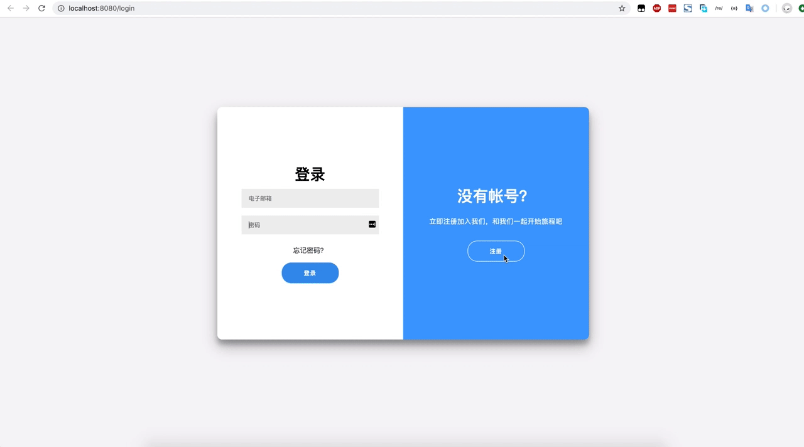

---

### 一个支持快速搭建支持私有化部署的个人私有云系统，又可以作为企业级分布式云存储解决方案。



## 功能特点(迭代中ing):
* [x]  依托于golang开发，支持各种平台部署
* [x] 前端分片上传、秒传文件
* [x] 下载支持分片、断点续传，轻松跑满带宽
* [x] 支持文件分享、快速转存，以及安全验证，轻松分享自己的资源
* [ ] 后端存储OSS(阿里云)、KODO(七牛云)、Ceph(私有分布式/aws)等

## 使用docker运行(docker-compose) 
_推荐将/uploads 挂载到你的本地目录，来保存真实的文件_

mac OS, Linux 在根目录下运行
```
$ ./start.sh
```

Windows 推荐使用git bash 在根目录下运行
如果失败，请手动运行
```
$ start.sh
```

## 自行搭建运行

1.git clone
```
git clone git@github.com:Code-Fight/GoCloud.git
```

2.go build 
```
cd GoCloud
go build cmd/main.go
```

3.init database
```
将 db 目录下的 init_db.sql 在您的mysql数据库下执行
并修改host
添加127.0.0.1 db
```

